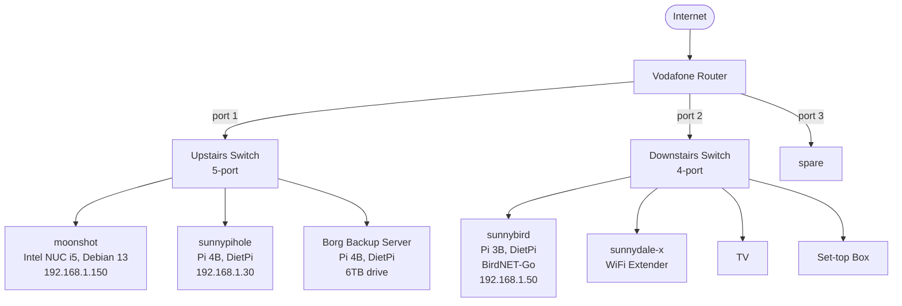

# Home Network Map

Kept as plain text (Mermaid syntax) so it's easy to diff in git and update
as things change — handy for the house move.

Paste any of the code blocks below into https://mermaid.live to preview,
or view directly in GitHub/GitLab/most markdown viewers, or VS Code with
the "Markdown Preview Mermaid Support" extension.

---

## Current topology (before the 5-port switch goes in)

```mermaid
graph TD
    INTERNET@{ shape: cloud }([Internet]) <--> ROUTER[Vodafone Router]

    ROUTER -->|port 1| MOONSHOT[moonshot<br/>Intel NUC i5, Debian 13<br/>192.168.1.150]
    ROUTER -->|port 2| PIHOLE[sunnypihole<br/>Pi 4B, DietPi<br/>Pi-hole + Unbound + DHCP<br/>192.168.1.30]
    ROUTER -->|port 3| SWITCH1[Downstairs Switch<br/>4-port unmanaged]

    SWITCH1 --> |port 1| BIRD[sunnybird<br/>Pi 3B, DietPi<br/>BirdNET-Go<br/>192.168.1.50]
    SWITCH1 --> |port 2| EXT[sunnydale-x<br/>WiFi Extender<br/>192.168.1.111]
    SWITCH1 --> |port 3| TV[TV<br/>192.168.1.20]
    SWITCH1 --> |port 4| STB[Set-top Box<br/>192.168.1.89]

    BORG[Borg Backup Server<br/>Pi 4B, DietPi<br/>6TB drive<br/>currently WiFi - unstable] -.WiFi.-> ROUTER

    MOONSHOT -->|USB| NIC[USB Gigabit Adapter<br/>UGREEN AX88179]

    FIRESTICK[TV<br/>192.168.1.164] -.WiFi.-> ROUTER
    SNOWSTORM[Laptop<br/>192.168.1.121] -.WiFi.-> ROUTER

    style BORG stroke-dasharray: 5 5
```

## Planned topology (once the 5-port switch is in)



---

## Syntax notes (for tweaking)

- `graph TD` = top-down layout. Use `graph LR` for left-right if that suits
  your shelf/room layout better.
- `A --> B` = an arrow/connection from A to B. `A -->|label text| B` puts a
  label on the connection (used above for router port numbers).
- `A -.-> B` = a dashed connection — used above for the Borg server's
  temporary/unstable WiFi link. `A -.label.-> B` labels a dashed line.
- `NODE[Text here]` = a rectangular box. `<br/>` inside the text forces a
  line break, handy for stacking hostname / hardware / IP on separate lines.
- `NODE([Text])` = a rounded/stadium shape — used above for "Internet" to
  visually distinguish it from physical devices.
- `style NODE stroke-dasharray: 5 5` = makes a node's outline dashed, another
  way to flag something as temporary/provisional (used for the Borg server
  in the "current" diagram).
- Node IDs (the short word before the `[...]`, e.g. `MOONSHOT`) must be
  unique per diagram but only need to be defined once — Mermaid remembers
  them for later connections.

## Ideas for extending this yourself

- Add `snowstorm-linux` (laptop, 192.168.1.121) and `tugboat` (Pi 4B,
  Raspbian Trixie) — likely WiFi-connected rather than switch-wired, so a
  dashed line from each to the router would match the convention above.
- Add a subgraph per physical location once you've moved, e.g.:
  ```
  subgraph Upstairs
      MOONSHOT
      PIHOLE
  end
  ```
  This visually groups devices by room, which could be genuinely useful
  for planning the new house's layout.
- Add MAC addresses or port numbers as extra label text if you want the
  diagram to double as a wiring reference during the move itself.
